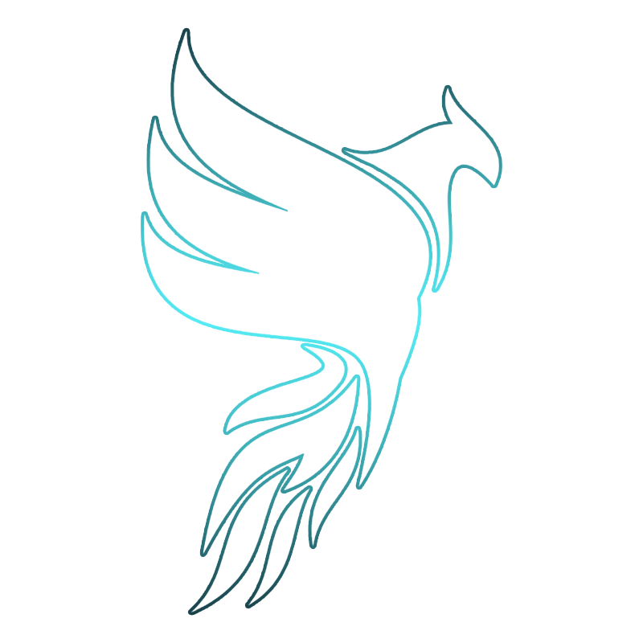

<p align="center">
  
</p>

<h1 align="center">👋 Hey, I'm Kyx</h1>

<p align="center">
  <b>FiveM Developer • Lua • Frontend • Custom Systems</b>
</p>

<p align="center">
  Developer at <b>Fly Labs Development</b> 🚀
</p>

<p align="center">
  Building clean, optimized and practical resources for FiveM communities.
</p>

---

## 👨‍💻 About Me

I'm **Kyx**, a developer and part of **Fly Labs Development**.

I'm mainly focused on creating custom systems and resources for **FiveM**, building scripts that are optimized, clean and useful for RP communities.

I enjoy working on both backend logic and modern user interfaces, combining **Lua development** with frontend technologies.

- 🔧 Custom **FiveM scripts & systems**
- 🎮 Working with **QBCore, Qbox & ESX**
- ⚡ Focused on performance and optimized code
- 🎨 Modern and responsive **NUI interfaces**
- 🧩 Custom framework integrations
- 🚀 Part of **Fly Labs Development**
- 📚 Always learning and improving
- 🤝 Open to interesting projects and collaborations

---

## 🛠️ Tech Stack

### 🔙 Backend


### 🌐 Frontend


### 🎮 FiveM


---

## 🚀 What I Build

```text
FiveM Development
├── Custom Systems
├── Gameplay Scripts
├── Server Utilities
├── NUI Interfaces
├── Framework Integrations
├── Quality of Life Systems
└── Custom RP Features
```

> **Clean systems. Good performance. Better player experience.**

---

## 📊 GitHub Stats

<p align="center">
  
</p>

<p align="center">
  
  
</p>

<p align="center">
  
  
</p>

---

## 📬 Contact

<p align="center">
  
  <a href="mailto:flylabs@outlook.com">
    
  </a>
  
</p>

---

<p align="center">
  <b>Kyx</b> • Fly Labs Development<br>
  <i>Always building. Always improving.</i>
</p>
